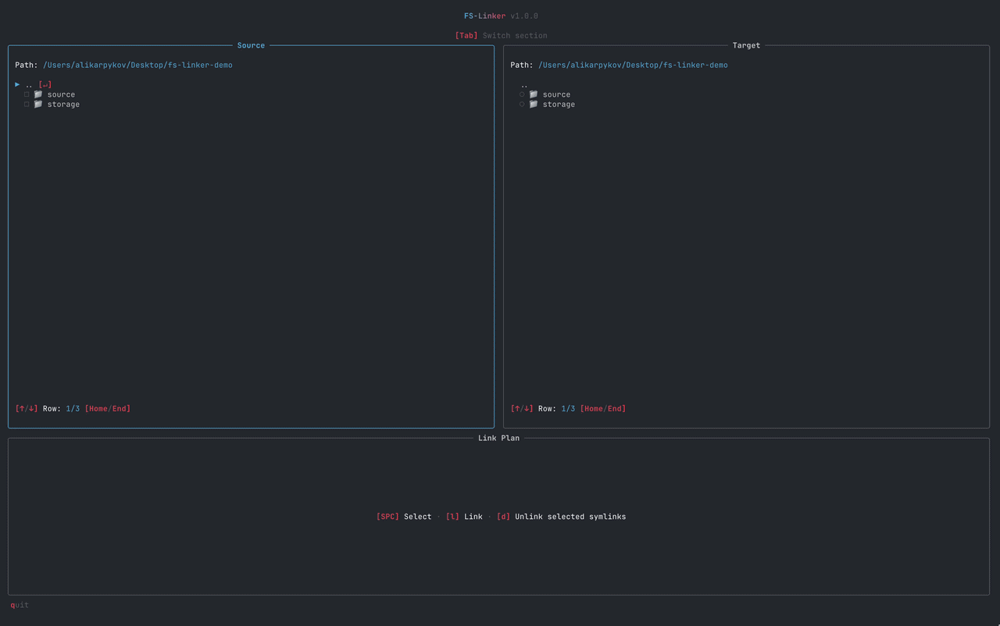

# FS-Linker

FS-Linker is an interactive terminal application for developers and power users who want to move files, project directories, or application data elsewhere while leaving native symbolic links at their original paths.

The destination can be another directory on the same SSD, another drive, or cloud storage. Tools and applications can continue accessing the data without changing their configured paths.



## How it works

FS-Linker uses two file-system panels and a Link Plan:

- **Source** is where you select the entries to move or relink. Their original paths are where the symbolic links will remain.
- **Target** is where you select the destination that will store the original data.
- **Link Plan** previews the result of every selected source before anything is changed.

For example, selecting:

```text
Source: /Users/me/projects/tokens
Target: /Volumes/Storage/data
```

produces this destination:

```text
/Volumes/Storage/data/tokens
```

After migration, the file system looks like this:

```text
/Users/me/projects/tokens -> /Volumes/Storage/data/tokens
```

The data lives in the target location, while software can continue using the original source path.

## Safety model

Every selected source is audited before the operation is executed. The Link Plan displays one of three results:

| Result       | Meaning                                                                                                                                                                      |
| ------------ | ---------------------------------------------------------------------------------------------------------------------------------------------------------------------------- |
| **Link**     | The source path is missing or already contains a symlink, and the destination exists. FS-Linker can create or replace the source symlink without moving data.                |
| **Migrate**  | The source contains a regular file or directory, and the destination is missing or empty. FS-Linker copies the data, removes the source, and creates a symlink in its place. |
| **Conflict** | The operation could overwrite data, use an unavailable or unsupported entry, create an invalid link, or otherwise cannot be performed safely. The source entry is skipped.   |

Important behavior:

- A non-empty target file or directory is never overwritten.
- An empty target file or directory may be replaced during migration.
- Source data is removed only after it has been copied to the target successfully.
- Symlink chains are supported. A target symlink may resolve through additional links, while a broken or circular target chain is treated as a conflict.
- A destination that resolves to the source path is treated as a conflict.
- Operations are processed sequentially and stop if a file-system operation fails.
- Unlinking removes only selected source symlinks. Target data remains untouched.

FS-Linker reduces the risk of accidental overwrites, but file-system operations are not transactional. Keep independent backups of important data.

## Requirements

- Node.js 22.18.0 or newer
- A terminal at least 110 columns wide and 40 rows high

On Windows, creating symbolic links may require Developer Mode or elevated permissions.

## Installation

Install FS-Linker globally from npm:

```bash
npm install --global fs-linker
```

Then open it from the directory you want to browse:

```bash
fsl
```

Both panels initially open in the current working directory.

## Usage

1. In the Source panel, select one or more files or directories.
2. In the Target panel, select a destination directory or file. Use a directory when linking multiple sources.
3. Review every entry in the Link Plan.
4. Press `l` to execute all non-conflicting entries.

When a directory is selected as the target, each source basename is appended to it. When a file is selected, that exact path is used as the target.

### Keyboard controls

| Key             | Action                                             |
| --------------- | -------------------------------------------------- |
| `Tab`           | Focus the next section                             |
| `Shift` + `Tab` | Focus the previous section                         |
| `Up` / `Down`   | Move the focused row                               |
| `Home` / `End`  | Move to the first or last row                      |
| `Enter`         | Open a directory or follow a symlink target        |
| `Space`         | Toggle the focused entry selection                 |
| `l`             | Link or migrate the ready entries in the Link Plan |
| `d`             | Remove the selected source symlinks                |
| `q`             | Quit                                               |

The Source panel supports multiple selections. The Target panel supports one selection.

## Unlinking

Press `d` to remove the selected source symlinks. Unlinking does not move the original data back to the source paths and never modifies the target data. Regular files and directories are not removed.

## Roadmap: restoring links on another device

A future version of FS-Linker will make it possible to restore saved symlink connections on another device.

## Development

This project uses pnpm:

```bash
pnpm install
pnpm build
pnpm start
```

Useful checks:

```bash
pnpm fmt:check
pnpm lint
pnpm build
```

To run the TypeScript compiler in watch mode:

```bash
pnpm dev
```

## License

[MIT](LICENSE) © 2026 Ali Karpykov
